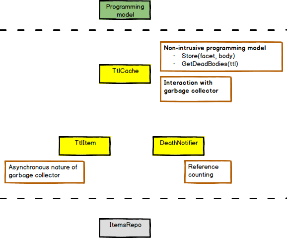
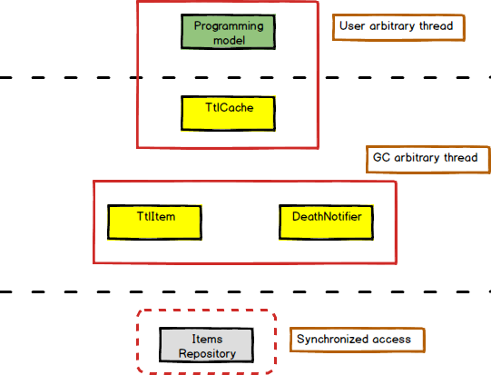
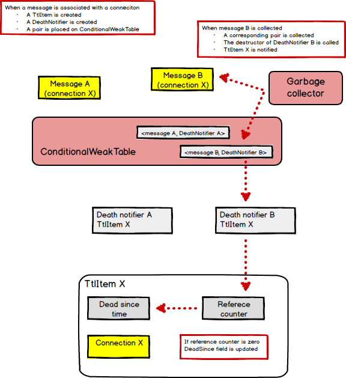
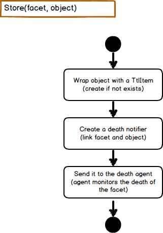
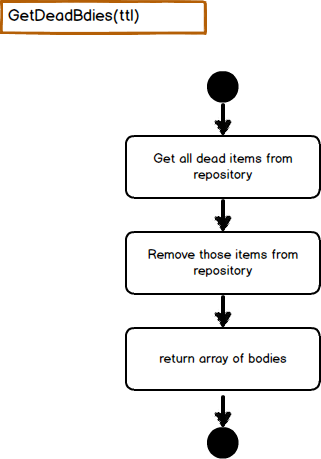

## Introduction

.Net 4 introduced a nifty class - a [ConditionalWeakTable](http://goo.gl/VfL1YB). It hides behind itself the ability to communicate to the garbage collector. 
In this article we will explore the hidden power of this communication.

**Disclaimer:**
This article is my personal exercise of the [IDesign](http://idesign.net/Training/Architect-Master-Class) way of thinking, i.e. the volatility way of thinking.

## Why and What

Let's imagine a system with clients talking to peers. Each message from a client to a peer requires a connection.
Establishing a connection is a heavy operation. We want to cache open connections.
A connection should be closed a while after all the messages of this specific connection are gone.

Here is a typical use case

- Look for a cached connection to the peer
- if a cached connection does not exist
    - open connection and store it to the cache
- use the connection to send a message to the peer

It is not that easy to implement. To cache a connection we have to store it in a data structure, preventing it from been garbage collected. So, we will need to maintain a reference counter per connection ourselves.
To do this, we will have to expose the Get/Release methods, that will be consumed by `using` directive with a `IDisposable` guard. 
The situation even worse if a message travels across multiple threads, since the `using` directive can't help us with threads.

Implementing all of the above just does not feel right. It feels like we are reinventing the garbage collector.
Can't we just use the garbage collector .Net provides us?

So here is our goal: a GC aware time-to-live cache.

## Design

### Volatilities

The main purpose of the `TtlCache` is to encapsulate the interaction with the garbage collector and time-to-live concerns in such a way that it will not pollute the design and the implementation of our own cache component.

Let's list the volatilities that such a cache should encapsulate:

- **Non-intrusive programming model**
  - No `using` and `Get`/`Release` methods 
  - No weak references
  - No base classes
  - No events to be subscribed to
 
- **Interaction with garbage collector**
  - Definitely cache has a tight interaction with GC, it should be encapsulated 
  
- **Asynchronous nature of garbage collector**
  - GC collects objects in its own threads. Any GC notification would be delivered in its arbitrary thread. That GC thread should be encapsulated.

- **Reference counting**
  - It is obvious that there is some reference counting mechanism in the cache. It should be encapsulated.

Here is the static view of the `TtlCache` ingredients (participants). The encapsulated volatilities are listed near each participant.

---

---

The `TtlCache` may be thought as a kind of map that maps a facet (lightweight object) to a body (heavy object). In our esoteric system a message is a facet to a connection. The `TtlCache` wraps an object with a `TtlItem` and stores it in a private repository `ItemsRepo`.
Then the `TtlCache` creates a `DeathNotifier` for each pair of the facet and the body. The `DeathNotifier` delegates the facet-is-garbage-collected event to the `TtlItem` where reference counter is maintained.


### Threads

Methods of the `TtlCache` are thread safe and can be called within an arbitrary thread. Since the`TtlCache` does not expose any events, its clients never deal with garbage collector threads either. The state of the `TtlCache` is stored in the `ItemsRepo` class which is protected by an exclusive lock.

---



### Interface

```C#
public interface ITtlCache<TFacet, TBody>
    where TFacet : class
    where TBody : class
{
    void Store(TFacet facet, TBody body);
    TBody[] GetDeadbodies(TimeSpan ttl);
}
```


## Usage example

Here is a basic unit test

```C#
class Message {}
class Connection {}

[Test]
public void Item_should_be_removed_after_its_death()
{
    var cache = TtlCache<Message, Connection>.New();

    var connection = new Connection();
    var message = new Message();

    cache.Store(message, connection);

    message = null;

    GC.Collect();
    GC.WaitForPendingFinalizers();
    Thread.Sleep(10.Milliseconds());

    var bodies = cache.GetDeadBodies(1.Milliseconds());

    Assert.That(bodies[0], Is.SameAs(connection));
}
```


## How does it work

The essential part of the implementation is the .Net core class [ConditionalWeakTable](http://goo.gl/VfL1YB). It was added to .Net 4 to help compilers to store custom properties per object. The `ConditionalWeakTable` gives us a possibility to associate any property (object) with a peer (another object) in such a way, that when the peer is collected by the garbage collector, the associated property is collected as well.

The central idea of the implementation is to associate with a given object a `DeathNotifier` class with a destructor. Thus when the given object is collected by the garbage collector the associated death-notifier is collected as well, and its destructor is called. So the destructor effectively becomes a the-given-object-is-collected event.


---

Here is the `DeathNotifier` essence.

```C#
class DeathNotifier
{
    private IReferenceCounter _reference;

    ~DeathNotifier()
    {
        var reference = _reference;

        if (reference != null)
            reference.ReleaseBody();
    }
}
```

Any given object is wrapped by an internal `TtlItem` that implements two interface `ITtlItem<TBody>` and `IReferenceCounter`.

```C#
interface ITtlItem<TBody>
    where TBody : class
{
    TBody Body { get; }
    DateTime DeadSince { get; }
}
```

```C#
interface IReferenceCounter
{
    void LinkBody();
    void ReleaseBody();
}
```

Here is how a `TtlItem` implements a reference counting and a dead-since logic.

```C#
class TtlItem<TBody> : ITtlItem<TBody>, IReferenceCounter
    where TBody : class
{
    void IReferenceCounter.LinkBody()
    {
        int count = Interlocked.Increment(ref _referenceCounter);

        if (count == 1)
            _deadSince = DateTime.MaxValue;
    }

    void IReferenceCounter.ReleaseBody()
    {
        int count = Interlocked.Decrement(ref _referenceCounter);

        if (count == 0)
            _deadSince = DateTime.UtcNow;
    }
}
```

### Use cases



---




## Summary

As we said before the main purpose of the `TtlCache` is encapsulating garbage collector and time-to-live concerns.

With the `TtlCache` you are free to implement your own cache component according to any logic required by your design.
The `TtlCache` provides you with garbage collector communication. You just add pairs of facet-to-body into it and ask when bodies may be disposed.
This way you are free to implement the clean-up logic the way you prefer. It may be an asynchronous periodically scheduled task, 
or a synchronous maintenance each time a connection is created. 

The `TtlCache` interface is simple: 

- Store to the cache
- Ask the cache for dead bodies.


